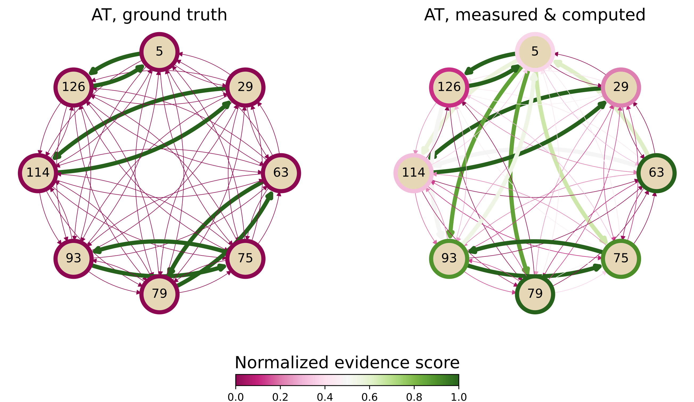

# Dibby

Dibby is a Python program toolkit aiming to discern the positions of disulphide bridges in a known protein from tandem spectrometry data. Dibby first matches in-silico generated fragments to the measured peaks, and then aggregates evidence from the matched fragments to determine the positions of disulphide bonds. 

Dibby's most interesting feature is its powerful fragment matching algorithm. It is able to identify even complicated multiply-linked fragments, or fragments with internal disulphide bonds.

An example output for lysozyme digested with trypsin can be seen below. You can see that three of the four bonds have been identified — only bidirectional green edges count as bond identifications.

Dibby started as a project for my bachelor thesis in the bioinformatics program at Charles University, Prague.

## Preparing data for Dibby

Namely, we made the Dibby with the following experiment setup in mind, but in theory it should be adaptable to different setups as well:

- LC-MS/MS, protease used for digestion can be configured
- ESI
- HCD fragmentation
- high-accuracy Orbitrap analyser

The data from the mass spectrometer should be exported in the `MGF` format. We do not recommend using trypsin for digestion, due to the common issue of disulphide bond scrambling.

## Running the analysis

The analysis has three steps: matching precursors, matching fragments, and producing the visualization. They need to be done in this order; the first two stages produce `.pickle` files to cache the results.

Namely, you can perform the analysis by following the following steps:

1. Run `src/precursor_matching.py` from the command line. Instead of supplying the paths to the fasta of the analyzed protein, and the path to the `MGF` file with the measured data, directly, you have to specify the name of the protein. The data will be loaded automatically based on the name of the protein from `data/fasta/___`, and `data/mgf/___` respectively — do not forget to supply these files. For other parameters, pass `--help` to the script, or check the source code.
2. Run `src/fragment_matching.py`. For the parameters, pass `--help` to the script, or check the source code. The script will automatically look for the pickle file generated by the previous stage, based on the passed parameters.
3. Run `src/visualize_bonds.py`. Make sure a folder named `out/plots` is at the root of the project --- the output plots will be saved there.

This workflow is a work in progress, and will change as a part of a bigger rewrite of Dibby. We do not recommend using Dibby in production yet.

## The near future

We will further research the viability of this approach to disulhpide bond mapping. Should it prove useful, we will rewrite Dibby in a more performant language, and redesign the whole analysis workflow during the transition. We also hope to provide better and more transparent scoring system for the fragment matches that will be based on probabilistic scores.